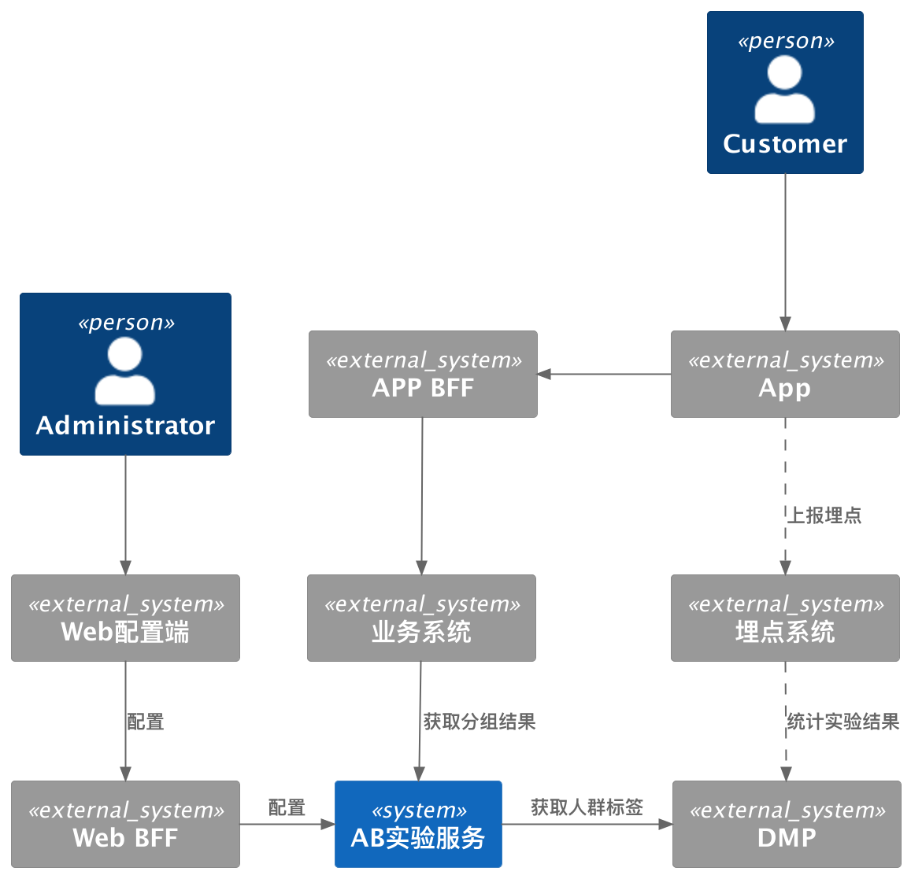
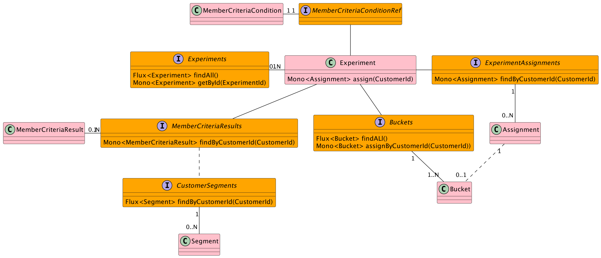

# ab-testing 
使用Smart Domain实现AB实验服务

## 业务上下文

AB实验服务管理AB实验生命周期

DMP根据用户属性或行为为用户添加标签，实验圈定相似属性的人来统计数据，增加实验可信度

AB实验服务根据用户标签判断用户是否进入实验

进入实验的用户随机分配实验组，并记录其分组结果，保证实验过程中用户分组结果固定

实验过程中，业务系统通过AB实验获取用户分组结果，根据分组生效不同配置

APP根据后端不同配置加载展示不同内容，通过埋点上报事件

DMP结合埋点和业务数据，分析实验结果

## 名词表
Experiment          -   实验

Bucket              -   实验分组

Assignment          -   实验分组结果

MemberCriteria      -   圈人条件（AB实验需要圈定某些特征的用户）

MemberCriteriaResult -  圈人结果（AB实验需要圈定某些特征的用户）

## Smart Domain 模型

